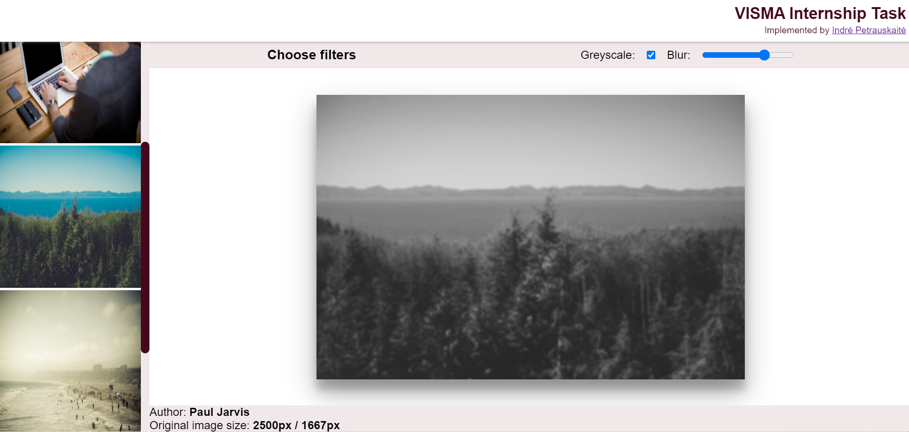

# :beginner: Simple gallery using JS

This project is meant to show what I have learned in the last few months since I began my journey as a front-end web developer.

## :dart: Project features

- [x] No libraries or frameworks. Created from scratch using only HTML, CSS and JS
- [x] Using API fetch (_[Lorem Picsum](https://picsum.photos/)_)
- [x] Infinite scroll on `div` (_horizontal on small screen, vertical on large_) / no scroll on main section
- [x] Functional image filters (_persists when loading different_ `img`)
- [x] Images protected from saving

## :princess: Author

**Indrė Petrauskaitė:**

:octocat: [GitHub](https://github.com/IndrePet)
:link: [LinkedIn](https://www.linkedin.com/in/indrepet/)

## :eye_speech_bubble: Preview

